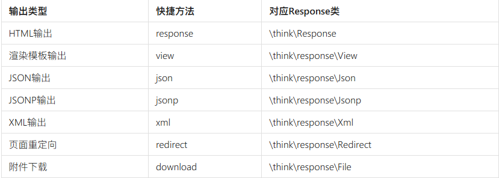

ThinkPHP 8.1.1
===============


> ThinkPHP8.1.1的运行环境要求PHP8.29

halt('输出测试');

## 请求
> 项目里面应该使用app\Request对象，该对象继承了系统的think\Request对象，但可以增加自定义方法或者覆盖已有方法。

> 在没有使用依赖注入的场合，可以通过Facade机制来静态调用请求对象的方法,该方法也同样适用于依赖注入无法使用的场合。

> 为了简化调用，系统还提供了request助手函数，可以在任何需要的时候直接调用当前请求对象。

```php
Request::param('name');
request()->param('name');

input('?get.id');
input('?post.name');
input('get.name','','htmlspecialchars');
input('get.id/d');
```

## 路由缓存
```php
// 定义GET请求路由规则 并设置3600秒的缓存
Route::get('new/:id','News/read')->cache(3600);
```
全局缓存 :
`'think\middleware\CheckRequestCache',`

## 响应
> 默认是输出Html输出，所以直接以html页面方式输出响应内容。如果你发起一个JSON请求的话，输出就会自动使用JSON格式响应输出。

> 最佳的方式是在控制器最后明确输出类型
> 

```php
写入cookie
response()->cookie('name', 'value', 600);
```

## 数据库

```php
// 如果希望查询数据不存在的时候返回空数组，可以使用
Db::table('think_user')->where('id', 1)->findOrEmpty();
// 如果希望在没有找到数据后抛出异常可以使用,如果没有查找到数据，则会抛出一个think\db\exception\DataNotFoundException异常。
Db::table('think_user')->where('id', 1)->findOrFail();

// select 方法查询结果是一个数据集对象，如果需要转换为数组可以使用
Db::table('think_user')->where('status', 1)->select()->toArray();
Db::table('think_user')->where('status',1)->selectOrFail();
```

## 事务
```php
Db::transaction(function () {
    Db::table('think_user')->find(1);
    Db::table('think_user')->delete(1);
});

// 启动事务
Db::startTrans();
try {
    Db::table('think_user')->find(1);
    Db::table('think_user')->delete(1);
    // 提交事务
    Db::commit();
} catch (\Exception $e) {
    // 回滚事务
    Db::rollback();
}

Db::transactionXa(function () {
    Db::connect('db1')->table('think_user')->delete(1);
    Db::connect('db2')->table('think_user')->delete(1);
}, [Db::connect('db1'),Db::connect('db2')]);

```

## 模型
```php
//uuid

<?php
class User extends Model
{
    protected $autoWriteId = true;
    protected function autoWriteId()
    {
        // 假设在公共函数文件中定义了uuid函数
        return uuid();
    }
}

新增数据的最佳实践原则：使用create方法新增数据，使用saveAll批量新增数据。


在取出数据后，更改字段内容后使用save方法更新数据。这种方式是最佳的更新方式。
更新的最佳实践原则是：如果需要使用模型事件，那么就先查询后更新，如果不需要使用事件或者不查询直接更新，直接使用静态的Update方法进行条件更新，如非必要，尽量不要使用批量更新。
$user = User::find(1);
$user->name     = 'thinkphp';
$user->email    = 'thinkphp@qq.com';
$user->save();

不要调用save方法进行多次数据写入。

删除的最佳实践原则是：如果删除当前模型数据，用delete方法，如果需要直接删除数据，使用destroy静态方法。
```

## 调试
一旦关闭调试模式，发生错误后不会提示具体的错误信息，如果你仍然希望看到具体的错误信息，那么可以在app.php文件中如下设置：
// 显示错误信息
'show_error_msg'        =>  true,    

## 上传
```php
public function upload(){
    // 获取表单上传文件 例如上传了001.jpg
    $file = request()->file('image');
    // 上传到本地服务器
    $savename = \think\facade\Filesystem::putFile( 'topic', $file);
}

//上传验证
public function upload(){
    // 获取表单上传文件
    $files = request()->file();
    try {
        validate(['image'=>'fileSize:10240|fileExt:jpg|image:200,200,jpg'])
            ->check($files);
        $savename = [];
        foreach($files as $file) {
            $savename[] = \think\facade\Filesystem::putFile( 'topic', $file);
        }
    } catch (\think\exception\ValidateException $e) {
        echo $e->getMessage();
    }
}
```

## 命令
在控制器中调用命令
```php
<?php
namespace app\index\controller;

use think\facade\Console;

class Index
{
    public function hello($name)
    {
        $output = Console::call('hello', [$name]);

        return $output->fetch();
    }
}
```